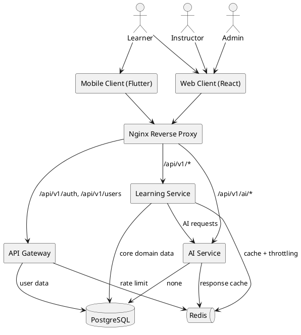
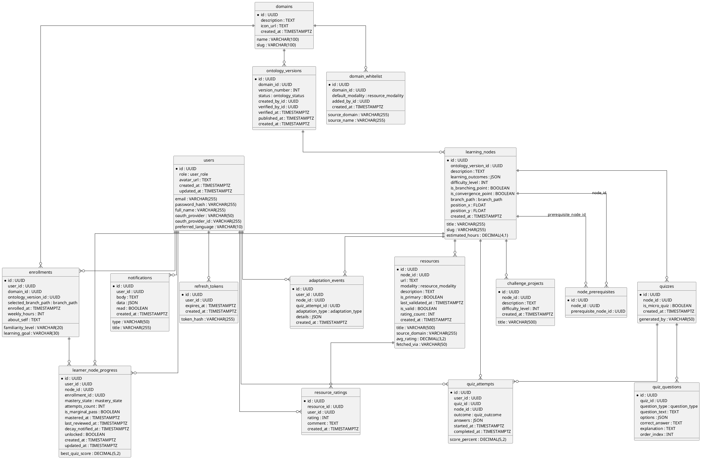
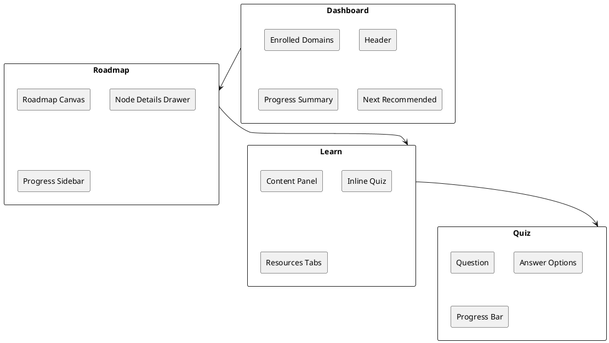
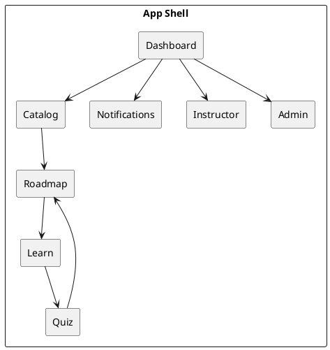
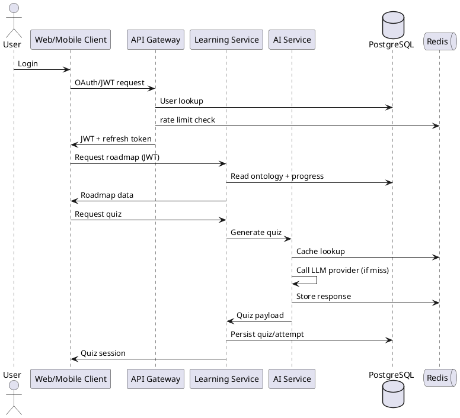

# Chapter Four: System Design

## 4.1 Overview

This chapter presents the complete system design for the AI-Driven Personalized Learning Roadmap Generator And Tutor and Tutor. The design translates the project objectives into a concrete, buildable architecture that supports personalized learning paths, adaptive assessments, and resource discovery while remaining secure, scalable, and maintainable. The design explicitly separates concerns between authentication, learning-domain logic, and AI-assisted services to ensure each capability can evolve and scale independently. The chapter also documents the data model, deployment topology, user interface strategy, system integration approach, security architecture, and verification steps that confirm the design satisfies all functional and non-functional requirements.

## 4.2 Specifying the Design Goals

The design goals align with the project scope, user needs, and operational constraints. Each goal guides architectural choices and is validated by concrete mechanisms in the implementation.

1. **Correctness and completeness**
   - Implement the full learning lifecycle: domain selection, enrollment, roadmap generation, progression tracking, gatekeeper quizzes, branching, decay handling, and notifications.
   - Preserve data integrity through strong relational constraints, indexed queries, and explicit state transitions for mastery.

2. **Performance and responsiveness**
   - Keep learner interactions fast (e.g., roadmap view and progress retrieval) using optimized indexes and read patterns.
   - Cache AI outputs and search results in Redis to avoid repeated expensive operations and reduce API latency.

3. **Scalability and extensibility**
   - Use a minimal microservice split to enable independent scaling of AI-heavy workloads and to isolate the security-critical gateway.
   - Allow future services (e.g., analytics or recommendation engines) to integrate without redesigning core modules.

4. **Security and privacy**
   - Enforce authentication and role-based authorization at the gateway and service layers.
   - Store sensitive data securely (hashed refresh tokens, controlled PII exposure) and ensure transport-level encryption in production.

5. **Availability and resilience**
   - Provide health checks and graceful failure paths; apply circuit breakers for AI services to prevent cascading failures.
   - Maintain continuity in the learning flow even when AI providers are unavailable by using cached or static fallbacks.

6. **Usability and accessibility**
   - Deliver a clean user experience across web and mobile clients with consistent UI patterns, progressive disclosure, and helpful feedback.
   - Support learners and instructors with task-specific views and clear next-step guidance.

## 4.3 System Design

### 4.3.1 Proposed Software Architecture

The system adopts a compact microservice architecture composed of three backend services, a reverse proxy, and shared infrastructure services (PostgreSQL and Redis). This architecture balances operational simplicity with the isolation required for security and AI workloads.

**Backend services**
- `api-gateway`: Handles authentication, OAuth, JWT issuance, RBAC enforcement, and user management.
- `learning-service`: Implements the core learning domain, including ontology management, enrollment, progress, quizzes, decay, branching, instructor and admin APIs.
- `ai-service`: Integrates external AI providers (Gemini) and optional local models (Ollama/Phi-4, Qwen2.5), applies caching and circuit-breakers, and serves AI-specific endpoints.

**Shared infrastructure**
- PostgreSQL: Single relational database containing the full learning model.
- Redis: Caching for AI responses, rate limiting, and transient state.
- Nginx: Reverse proxy and routing across backend services.

The architecture is implemented in the runtime topology in `backend/docker-compose.yml` and routing rules in `backend/nginx/nginx.conf`. Service middleware and entrypoints are implemented in `backend/services/api-gateway/src/app.ts`, `backend/services/learning-service/src/app.ts`, and `backend/services/ai-service/src/app.ts`.

**Architecture Diagram**



### 4.3.2 Subsystem Decomposition

The system is decomposed into logical subsystems to reduce complexity and isolate responsibilities.

1. **Authentication and Gateway Subsystem**
   - Responsibilities: OAuth login, JWT issuance and verification, refresh token lifecycle, RBAC, user profile management.
   - Boundary: All auth and user operations flow through the gateway; non-auth domain operations are proxied to the learning-service.
   - Implementation: Modules under `backend/services/api-gateway/src/modules/auth` and `backend/services/api-gateway/src/modules/users`.

2. **Learning Domain Subsystem**
   - Responsibilities: Ontology versioning and DAG management, enrollment, progress, quizzes, branching logic, mastery decay, notifications, and admin/instructor analytics.
   - Boundary: Owns all database writes for the learning model and exposes domain-specific APIs.
   - Implementation: Modules under `backend/services/learning-service/src/modules`.

3. **AI Integration Subsystem**
   - Responsibilities: Quiz generation, explanation generation, resource discovery, fallback model usage (Phi-4-Multimodal primary via Kaggle, Qwen2.5-3B secondary via Ollama, Gemini 2.5 Flash tertiary API last resort), caching, circuit breakers.
   - Boundary: Exposes AI endpoints to learning-service; does not directly mutate core domain state.
   - Implementation: `backend/services/ai-service/src/modules/ai`.

4. **Client Applications**
   - Web client: React + Vite application providing learner, instructor, and admin interfaces. Source code in `frontend/src`.
   - Mobile client: Flutter application focusing on learner flow and essential admin features. Source code in `flutter_mobile/lib`.

5. **Shared Infrastructure**
   - PostgreSQL for persistence and transactional integrity.
   - Redis for caching and rate limiting.

### 4.3.3 Database Design

The data model is implemented in PostgreSQL and defined by Prisma in `backend/services/learning-service/prisma/schema.prisma`. This subsection lists all entities, attributes, constraints, and relationships to show how data is stored, accessed, and managed over time.

**Enumerations**

- `UserRole`: `learner`, `domain_expert`, `admin`
- `MasteryState`: `not_started`, `in_progress`, `mastered`, `review_needed`, `relearn`
- `QuizOutcome`: `strong_pass`, `marginal_pass`, `fail_low`, `fail_fundamental`, `fail_severe`
- `QuestionType`: `multiple_choice`, `short_answer`, `code_completion`, `true_false`, `matching`
- `ResourceModality`: `documentation`, `tutorial`, `video`, `interactive`, `reference`
- `OntologyStatus`: `draft`, `in_review`, `verified`, `published`, `archived`
- `AdaptationType`: `resource_swap`, `prerequisite_review`, `instructor_escalation`, `decay_micro_quiz`
- `BranchPath`: `frontend`, `backend`, `data_science`

**Entities, attributes, and constraints**

**users**

| Column | Type | Constraints |
|---|---|---|
| id | UUID | PK, default `gen_random_uuid()` |
| email | VARCHAR(255) | UNIQUE, NOT NULL |
| password_hash | VARCHAR(255) | NULLABLE |
| full_name | VARCHAR(255) | NOT NULL |
| role | user_role | DEFAULT `learner` |
| avatar_url | TEXT | NULLABLE |
| oauth_provider | VARCHAR(50) | NULLABLE |
| oauth_provider_id | VARCHAR(255) | NULLABLE |
| preferred_language | VARCHAR(10) | DEFAULT `en` |
| created_at | TIMESTAMPTZ | DEFAULT now() |
| updated_at | TIMESTAMPTZ | AUTO UPDATED |

**domains**

| Column | Type | Constraints |
|---|---|---|
| id | UUID | PK, default `gen_random_uuid()` |
| name | VARCHAR(100) | UNIQUE, NOT NULL |
| slug | VARCHAR(100) | UNIQUE, NOT NULL |
| description | TEXT | NULLABLE |
| icon_url | TEXT | NULLABLE |
| created_at | TIMESTAMPTZ | DEFAULT now() |

**ontology_versions**

| Column | Type | Constraints |
|---|---|---|
| id | UUID | PK, default `gen_random_uuid()` |
| domain_id | UUID | FK -> domains.id, NOT NULL |
| version_number | INT | NOT NULL |
| status | ontology_status | DEFAULT `draft` |
| created_by_id | UUID | FK -> users.id, NOT NULL |
| verified_by_id | UUID | FK -> users.id, NULLABLE |
| verified_at | TIMESTAMPTZ | NULLABLE |
| published_at | TIMESTAMPTZ | NULLABLE |
| created_at | TIMESTAMPTZ | DEFAULT now() |
| UNIQUE | | (domain_id, version_number) |

**learning_nodes**

| Column | Type | Constraints |
|---|---|---|
| id | UUID | PK, default `gen_random_uuid()` |
| ontology_version_id | UUID | FK -> ontology_versions.id, NOT NULL |
| title | VARCHAR(255) | NOT NULL |
| slug | VARCHAR(255) | NOT NULL |
| description | TEXT | NULLABLE |
| learning_outcomes | JSON | NOT NULL |
| estimated_hours | DECIMAL(4,1) | NULLABLE |
| difficulty_level | INT | NULLABLE |
| is_branching_point | BOOLEAN | DEFAULT false |
| is_convergence_point | BOOLEAN | DEFAULT false |
| branch_path | branch_path | NULLABLE |
| position_x | FLOAT | NULLABLE |
| position_y | FLOAT | NULLABLE |
| created_at | TIMESTAMPTZ | DEFAULT now() |
| UNIQUE | | (ontology_version_id, slug) |

**node_prerequisites**

| Column | Type | Constraints |
|---|---|---|
| id | UUID | PK, default `gen_random_uuid()` |
| node_id | UUID | FK -> learning_nodes.id, NOT NULL |
| prerequisite_node_id | UUID | FK -> learning_nodes.id, NOT NULL |
| UNIQUE | | (node_id, prerequisite_node_id) |

**enrollments**

| Column | Type | Constraints |
|---|---|---|
| id | UUID | PK, default `gen_random_uuid()` |
| user_id | UUID | FK -> users.id, NOT NULL |
| domain_id | UUID | FK -> domains.id, NOT NULL |
| ontology_version_id | UUID | FK -> ontology_versions.id, NOT NULL |
| selected_branch_path | branch_path | NULLABLE |
| enrolled_at | TIMESTAMPTZ | DEFAULT now() |
| weekly_hours | INT | NULLABLE |
| familiarity_level | VARCHAR(20) | NULLABLE |
| learning_goal | VARCHAR(30) | NULLABLE |
| about_self | TEXT | NULLABLE |
| UNIQUE | | (user_id, domain_id) |

**learner_node_progress**

| Column | Type | Constraints |
|---|---|---|
| id | UUID | PK, default `gen_random_uuid()` |
| user_id | UUID | FK -> users.id, NOT NULL |
| node_id | UUID | FK -> learning_nodes.id, NOT NULL |
| enrollment_id | UUID | FK -> enrollments.id, NOT NULL |
| mastery_state | mastery_state | DEFAULT `not_started` |
| best_quiz_score | DECIMAL(5,2) | NULLABLE |
| attempts_count | INT | DEFAULT 0 |
| is_marginal_pass | BOOLEAN | DEFAULT false |
| mastered_at | TIMESTAMPTZ | NULLABLE |
| last_reviewed_at | TIMESTAMPTZ | NULLABLE |
| decay_notified_at | TIMESTAMPTZ | NULLABLE |
| unlocked | BOOLEAN | DEFAULT false |
| created_at | TIMESTAMPTZ | DEFAULT now() |
| updated_at | TIMESTAMPTZ | AUTO UPDATED |
| UNIQUE | | (user_id, node_id) |

**quizzes**

| Column | Type | Constraints |
|---|---|---|
| id | UUID | PK, default `gen_random_uuid()` |
| node_id | UUID | FK -> learning_nodes.id, NOT NULL |
| is_micro_quiz | BOOLEAN | DEFAULT false |
| generated_by | VARCHAR(50) | NOT NULL |
| created_at | TIMESTAMPTZ | DEFAULT now() |

**quiz_questions**

| Column | Type | Constraints |
|---|---|---|
| id | UUID | PK, default `gen_random_uuid()` |
| quiz_id | UUID | FK -> quizzes.id, NOT NULL (CASCADE DELETE) |
| question_type | question_type | NOT NULL |
| question_text | TEXT | NOT NULL |
| options | JSON | NULLABLE |
| correct_answer | TEXT | NOT NULL |
| explanation | TEXT | NULLABLE |
| order_index | INT | NOT NULL |

**quiz_attempts**

| Column | Type | Constraints |
|---|---|---|
| id | UUID | PK, default `gen_random_uuid()` |
| user_id | UUID | FK -> users.id, NOT NULL |
| quiz_id | UUID | FK -> quizzes.id, NOT NULL |
| node_id | UUID | FK -> learning_nodes.id, NOT NULL |
| score_percent | DECIMAL(5,2) | NOT NULL |
| outcome | quiz_outcome | NOT NULL |
| answers | JSON | NOT NULL |
| started_at | TIMESTAMPTZ | NOT NULL |
| completed_at | TIMESTAMPTZ | NOT NULL |

**resources**

| Column | Type | Constraints |
|---|---|---|
| id | UUID | PK, default `gen_random_uuid()` |
| node_id | UUID | FK -> learning_nodes.id, NOT NULL |
| title | VARCHAR(500) | NOT NULL |
| url | TEXT | NOT NULL |
| source_domain | VARCHAR(255) | NOT NULL |
| modality | resource_modality | NOT NULL |
| description | TEXT | NULLABLE |
| is_primary | BOOLEAN | DEFAULT false |
| last_validated_at | TIMESTAMPTZ | NULLABLE |
| is_valid | BOOLEAN | DEFAULT true |
| avg_rating | DECIMAL(3,2) | DEFAULT 0.00 |
| rating_count | INT | DEFAULT 0 |
| fetched_via | VARCHAR(50) | NOT NULL |
| created_at | TIMESTAMPTZ | DEFAULT now() |

**resource_ratings**

| Column | Type | Constraints |
|---|---|---|
| id | UUID | PK, default `gen_random_uuid()` |
| resource_id | UUID | FK -> resources.id, NOT NULL |
| user_id | UUID | FK -> users.id, NOT NULL |
| rating | INT | NOT NULL |
| comment | TEXT | NULLABLE |
| created_at | TIMESTAMPTZ | DEFAULT now() |
| UNIQUE | | (resource_id, user_id) |

**domain_whitelist**

| Column | Type | Constraints |
|---|---|---|
| id | UUID | PK, default `gen_random_uuid()` |
| domain_id | UUID | FK -> domains.id, NOT NULL |
| source_domain | VARCHAR(255) | NOT NULL |
| source_name | VARCHAR(255) | NOT NULL |
| default_modality | resource_modality | NOT NULL |
| added_by_id | UUID | FK -> users.id, NULLABLE |
| created_at | TIMESTAMPTZ | DEFAULT now() |
| UNIQUE | | (domain_id, source_domain) |

**adaptation_events**

| Column | Type | Constraints |
|---|---|---|
| id | UUID | PK, default `gen_random_uuid()` |
| user_id | UUID | FK -> users.id, NOT NULL |
| node_id | UUID | FK -> learning_nodes.id, NOT NULL |
| quiz_attempt_id | UUID | FK -> quiz_attempts.id, NULLABLE |
| adaptation_type | adaptation_type | NOT NULL |
| details | JSON | NULLABLE |
| created_at | TIMESTAMPTZ | DEFAULT now() |

**challenge_projects**

| Column | Type | Constraints |
|---|---|---|
| id | UUID | PK, default `gen_random_uuid()` |
| node_id | UUID | FK -> learning_nodes.id, NOT NULL |
| title | VARCHAR(500) | NOT NULL |
| description | TEXT | NOT NULL |
| difficulty_level | INT | NULLABLE |
| created_at | TIMESTAMPTZ | DEFAULT now() |

**notifications**

| Column | Type | Constraints |
|---|---|---|
| id | UUID | PK, default `gen_random_uuid()` |
| user_id | UUID | FK -> users.id, NOT NULL |
| type | VARCHAR(50) | NOT NULL |
| title | VARCHAR(255) | NOT NULL |
| body | TEXT | NULLABLE |
| data | JSON | NULLABLE |
| read | BOOLEAN | DEFAULT false |
| created_at | TIMESTAMPTZ | DEFAULT now() |

**refresh_tokens**

| Column | Type | Constraints |
|---|---|---|
| id | UUID | PK, default `gen_random_uuid()` |
| user_id | UUID | FK -> users.id, NOT NULL (CASCADE DELETE) |
| token_hash | VARCHAR(255) | NOT NULL |
| expires_at | TIMESTAMPTZ | NOT NULL |
| created_at | TIMESTAMPTZ | DEFAULT now() |

**Relationships summary**

- `users` 1..* `enrollments`, `learner_node_progress`, `quiz_attempts`, `resource_ratings`, `notifications`, `adaptation_events`, `refresh_tokens`
- `domains` 1..* `ontology_versions`, `enrollments`, `domain_whitelist`
- `ontology_versions` 1..* `learning_nodes`
- `learning_nodes` 1..* `quizzes`, `resources`, `challenge_projects`, `learner_node_progress`, `adaptation_events`
- `learning_nodes` *..* `learning_nodes` via `node_prerequisites`

**ER Diagram (full attributes)**



### 4.3.4 Deployment Diagram

The deployment configuration is defined in `backend/docker-compose.yml`. The reverse proxy routing rules are defined in `backend/nginx/nginx.conf`. The physical arrangement below clarifies network boundaries, service responsibilities, and shared infrastructure, which helps identify scaling or performance bottlenecks.

**Deployment topology (physical view)**

- Clients (web and mobile) communicate over HTTPS to the reverse proxy.
- Nginx routes requests by URL prefix to the correct backend service.
- `api-gateway` and `learning-service` connect to the same PostgreSQL database and Redis instance.
- `ai-service` uses Redis for cache and throttling but does not write to the database.
- Each service runs in its own container for isolation and independent scaling.

**Scalability and performance considerations**

- The reverse proxy is a potential choke point; in production, use a managed load balancer or ingress controller.
- `ai-service` is the most latency-sensitive component; it should scale horizontally and use caching to reduce AI-provider load.
- PostgreSQL is the primary shared dependency; its performance directly affects read-heavy endpoints like roadmap and progress.
- Redis reduces database pressure by caching AI responses and rate-limiter state.

**Deployment Diagram (detailed)**

```plantuml
@startuml
skinparam nodeStyle rectangle
skinparam shadowing false

node "Client Devices" as Clients {
  [Web Browser]
  [Mobile App]
}

node "Edge / Reverse Proxy" as Proxy {
  [Nginx]
}

node "Backend Cluster" as Backend {
  [API Gateway]\nport 3000
  [Learning Service]\nport 3001
  [AI Service]\nport 3002
}

database "PostgreSQL" as DB
queue "Redis" as Redis

Clients --> Proxy : HTTPS
Proxy --> [API Gateway] : /api/v1/auth, /api/v1/users
Proxy --> [Learning Service] : /api/v1/*
Proxy --> [AI Service] : /api/v1/ai/*

[API Gateway] --> DB : user + auth data
[API Gateway] --> Redis : rate limiting

[Learning Service] --> DB : ontology + progress + quizzes
[Learning Service] --> Redis : cache + throttling

[AI Service] --> Redis : response cache

@enduml
```

### 4.3.5 User Interface Design

The UI layer follows a user-centered design approach focused on clarity, progressive disclosure, and continuous feedback. Learners are guided from onboarding to actionable next steps, while instructors and administrators are provided with analytical views and management workflows. The design prioritizes accessibility, predictable navigation, and minimal cognitive load.

**Design principles (user-centered)**

- **Learnability:** Clear, consistent layouts across web and mobile reduce onboarding time.
- **Guidance:** Contextual panels and progress indicators highlight next actions.
- **Feedback:** Immediate visual feedback for quiz outcomes, mastery states, and system notifications.
- **Accessibility:** High-contrast typography, keyboard focus states, and scalable layout on different devices.

**Web client**

- Implemented in React with Vite; feature modules are organized under `frontend/src/features`.
- Core pages include Dashboard, Domain Catalog, Roadmap, Learn, Quiz, Notifications, Instructor, and Admin.

**Mobile client**

- Implemented in Flutter; features include enrollments, roadmap view, quiz attempts, and notifications. Source code in `flutter_mobile/lib`.

**Key interaction patterns**

- **Roadmap view:** Canvas + side drawer to keep the learning graph visible while exploring node details.
- **Learn view:** Content-first layout with inline quizzes and resource tabs to minimize context switching.
- **Quiz flow:** Progress bar with immediate post-quiz feedback and remediation options.
- **Instructor/Admin dashboards:** Table + summary cards for quick status review, with drill-down panels.

**UI mockups (wireframe navigation)**



**UI Navigation Diagram**



### 4.3.6 System Integration

System integration defines how independent components cooperate to deliver a seamless learning experience. It covers API interoperability, data exchange, and the use of third-party services such as OAuth providers and AI platforms. The integration strategy prioritizes clear boundaries, strict contracts, and resilient communication.

**Integration architecture and interoperability**

- **Service boundaries:** Each backend service exposes a stable REST API. The `api-gateway` owns authentication and user identity; the `learning-service` owns domain data and learning flows; the `ai-service` owns AI and resource generation. The reverse proxy routes traffic so clients do not need to manage service discovery.
- **Compatibility:** All APIs are versioned under `/api/v1`, enabling backward compatibility. Swagger/OpenAPI documents are exposed for each service, and clients rely on these contracts to generate or validate API calls.
- **Data exchange:** JSON is the primary exchange format. All services enforce request/response schemas and validate payloads to prevent mismatches or malformed data.

**Integration flows (detailed)**

1. **Authentication and session management**
   - The client authenticates via OAuth (Google, GitHub) or email/password through the `api-gateway`.
   - On success, the gateway issues a JWT access token and a hashed refresh token, storing refresh tokens in the database.
   - The client includes `Authorization: Bearer <token>` for all protected requests to the learning-service.

2. **Learning data flow**
   - The client requests a roadmap; the learning-service retrieves ontology versions, nodes, and progress data from PostgreSQL.
   - Progress updates (quiz results, mastery transitions) are persisted and may trigger adaptation events and notifications.

3. **AI-assisted generation flow**
   - When a learner requests a quiz or explanation, the learning-service calls the ai-service.
   - The ai-service checks Redis for cached outputs; on cache miss, it queries an AI provider (Phi-4-Multimodal via Kaggle) with fallback to Qwen2.5-3B (via Ollama) and finally Gemini 2.5 Flash (API last resort).
   - Results are cached and returned to the learning-service, which persists quiz metadata and serves the response to the client.

4. **Notification and background workflows**
   - Scheduled tasks in the learning-service analyze decay and progress to generate reminders or micro-quizzes.
   - Notifications are stored and delivered to the client in the notifications panel.

**Third-party services integration**

- **OAuth providers:** Google and GitHub are used for external authentication. Callback routes are hosted in the api-gateway, ensuring consistent user identity handling.
- **AI providers:** Phi-4-Multimodal (primary, via Kaggle), Qwen2.5-3B (secondary, via Ollama), and Gemini 2.5 Flash (tertiary, API last resort) are abstracted behind ai-service; this isolates AI dependencies from core business logic.
- **Search provider:** Resource discovery uses Google Programmable Search Engine (PSE) API, encapsulated in the learning-service to keep retrieval logic consistent.

**Integration reliability and error handling**

- Timeouts and circuit breakers are applied to AI calls to prevent upstream failures from impacting the core learning experience.
- The circuit breaker pattern tracks consecutive failures per provider (threshold: 5 failures within 5 minutes), automatically falling back to the next tier.
- Retries and backoff policies are applied to transient errors in AI and search providers.
- Each service exposes `/health` endpoints for monitoring and automated recovery.

**Sequence Diagram (Auth + AI Flow)**



### 4.3.7 Security Design

Security is integrated throughout the system to protect user data, prevent abuse, and ensure trustworthy operation. The security design focuses on authentication, authorization, data protection, secure communication, and operational safeguards.

**Authentication**

- The system uses JWT access tokens for stateless authentication, issued by the api-gateway.
- Refresh tokens are stored hashed in the database to mitigate token leakage risks.
- OAuth integration uses secure callback URLs and state validation to protect against CSRF attacks.

**Authorization (RBAC)**

- Role-based access control ensures learners, instructors, and admins only access permitted routes.
- Gateway middleware enforces role checks for sensitive endpoints, and services validate roles for defense in depth.
- Three roles are defined: `learner`, `domain_expert`, and `admin`, each with distinct permission sets.

**Encryption and secure transport**

- TLS is required in production to protect credentials and tokens in transit.
- Sensitive data (password hashes, refresh tokens) is stored using strong one-way hashing algorithms (bcrypt).
- Database encryption at rest is planned for production deployment.

**Input validation and sanitization**

- All incoming requests are validated against schemas (Joi), rejecting malformed or unexpected payloads.
- Sanitization middleware removes potentially unsafe characters from user inputs to mitigate injection attacks.

**Rate limiting and abuse prevention**

- Redis-backed rate limiting is applied globally and specifically to authentication endpoints.
- Brute-force attacks are mitigated through request throttling and account lockout policies.

**AI and third-party risk controls**

- AI service calls are wrapped with circuit breakers and timeouts to prevent cascading failures.
- Cached AI responses reduce repeated exposure to external systems and limit provider dependency.
- Three-tier provider fallback ensures availability even when primary AI services are unreachable.

**Auditability and monitoring**

- Structured logging captures authentication attempts, errors, and critical domain actions.
- Health endpoints enable monitoring and alerting for availability and security incidents.

**Secure configuration and secrets management**

- Development uses environment variables; production should use a dedicated secrets manager.
- Sensitive values are excluded from version control and injected during deployment.

**Hardening and testing**

- Dependency scanning, static analysis, and penetration testing are required before deployment.
- A hardening checklist is documented in `docs/backend/12-hardening.md`.

## 4.4 Verifying the Requirements in the Design

This section verifies the design against the full set of functional and non-functional requirements. The verification strategy combines traceability, architectural inspection, automated testing, and operational validation. Each requirement is mapped to design artifacts and a concrete verification method, with clear evidence and a defined discrepancy-resolution process.

### 4.4.1 Requirements Traceability Approach

- **Mapping:** Every requirement is linked to a subsystem and one or more design artifacts (data model, API routes, service modules, UI screens, or infrastructure).
- **Verification:** Each requirement has a validation method (unit, integration, end-to-end, load, or security tests).
- **Evidence:** Evidence is collected from tests, CI runs, and runtime checks (health endpoints, logs, and monitoring).

### 4.4.2 Functional Requirements Verification Matrix

| Requirement | Design Coverage | Verification Method | Evidence/Artifact |
|---|---|---|---|
| FR1.1 Ontology generation (Teacher Model) | Ontology module + JSON structure in learning-service | Offline generation test + JSON schema validation | Ontology JSON schema tests |
| FR1.2 Expert verification workflow | Admin/instructor APIs + ontology status fields | Integration tests for review/approve flow | Admin/ontology routes + role checks |
| FR1.3 Ontology versioning + rollback | OntologyVersion model + status transitions | Integration tests for version creation and retrieval | Prisma schema + ontology tests |
| FR2.1 User registration + social login | api-gateway auth + OAuth callbacks | Auth flow tests + OAuth callback tests | Auth module + login E2E |
| FR2.2 Progress tracking | LearnerNodeProgress model + progress routes | Integration tests for attempts and timestamps | Progress routes + DB constraints |
| FR2.3 Learner statistics | Aggregation queries in learning-service | API tests for stats endpoints | Instructor analytics endpoints |
| FR3.1 Quiz generation (Tutor Model) | ai-service quiz generation + learning-service persistence | Contract tests + schema validation | AI routes + quiz persistence tests |
| FR3.2 Multiple question types | QuestionType enum + quiz_questions table | Unit tests for validation | Prisma enums + quiz validation |
| FR3.3 Quiz evaluation + feedback | QuizAttempt + scoring logic | Unit tests for scoring + E2E quiz flow | Quiz service tests + Playwright |
| FR3.4 Micro-quizzes on decay | Decay scheduler + ai-service | Integration tests for decay transitions | Decay module + notification tests |
| FR4.1 Three-tier progression logic | Gatekeeper service + mastery states | Unit tests for thresholds + transitions | Gatekeeper tests |
| FR4.2 Prerequisite validation | NodePrerequisite + roadmap unlock logic | Integration tests for lock/unlock | NodePrerequisite constraints |
| FR4.3 Challenge project recommendation | ChallengeProject + post-pass flow | Integration tests after strong pass | Challenge project service tests |
| FR4.4 Resource adaptation on fail | AdaptationEvent + resource swap | Integration tests for fail outcomes | Adaptation event logs |
| FR5.1 PSE resource fetch (whitelist) | Resource service + domain whitelist | API tests with mocked PSE | Resource service tests |
| FR5.2 Link validation | Link validator + resource checks | Integration tests for HTTP status validation | Link validation service |
| FR5.3 Learner feedback on resources | ResourceRating model + endpoints | CRUD API tests for ratings | Resource rating routes |
| FR5.4 Modality-based alternatives | Resource modality + adaptation logic | Integration tests for swap logic | Resource adaptation tests |
| FR6.1 Decay state computation | Decay scheduler + timestamps | Unit tests for thresholds | Decay service tests |
| FR6.2 Auto micro-quiz on decay | Decay + ai-service | Integration test for decay->quiz | Decay scheduler tests |
| FR6.3 Visualize decay in roadmap | Roadmap UI + node state | UI tests for color states | Frontend roadmap tests |
| FR6.4 Notifications for review | Notifications module | Integration tests for notification creation | Notifications routes |
| FR7.1 Branching identification | BranchPath field + ontology rules | Unit tests for branching nodes | Ontology validation tests |
| FR7.2 Branch choice + recommendations | Branching API + UI modal | E2E test for branching flow | Branching UI tests |
| FR7.3 Dynamic roadmap adjustment | Roadmap filtering by path | E2E test for branch selection | Roadmap endpoint tests |
| FR7.4 Path reconvergence | Ontology rules + DAG validation | Unit tests for reconvergence | Ontology DAG validation |
| FR8.1 Interactive DAG UI | Roadmap canvas components | UI interaction tests | Roadmap component tests |
| FR8.2 Quiz, dashboard, settings | UI pages + routing | E2E tests across pages | Playwright suites |
| FR8.3 Mobile UX + offline cache | Flutter app + cached roadmap | Mobile tests + offline simulation | Flutter tests |
| FR8.4 Responsive UI | CSS breakpoints + layout tests | Visual regression tests | Frontend layout tests |

### 4.4.3 Non-Functional Requirements Verification Matrix

| Requirement | Design Coverage | Verification Method | Evidence/Artifact |
|---|---|---|---|
| NFR1.1 Roadmap load <=2s | Indexed queries + caching | Performance test + p95 latency | Load test report |
| NFR1.2 Quiz API p95 <=500ms | Rate-limited endpoints + caching | Load test + API latency tracking | API performance report |
| NFR1.3 LLM quiz <=3s | AI cache + fallback | Timing tests + cache hit ratio | AI service metrics |
| NFR2.1 1,000 concurrent users | Horizontal scaling + stateless API | Load test with concurrency | Load test report |
| NFR2.2 DB/Redis scaling | Read replicas + caching design | Architectural validation | Deployment plan |
| NFR2.3 Multi-tenancy ready | Namespacing strategy + config boundaries | Design review | Architecture review notes |
| NFR3.1 99.5% uptime | Health checks + monitoring | Availability monitoring | Uptime dashboard |
| NFR3.2 Backup + recovery (4h) | DB backup plan | Recovery drill | Backup logs |
| NFR3.3 Graceful AI fallback | Circuit breakers + cached quizzes | Failure simulation | AI outage test |
| NFR4.1 JWT + httpOnly cookies | Gateway auth design | Security review + E2E auth test | Auth tests |
| NFR4.2 Encryption in transit/at rest | TLS + DB encryption plan | Security audit | Security checklist |
| NFR4.3 RBAC roles | Role-based middleware | Role access tests | RBAC test suite |
| NFR4.4 Input sanitization | Validation + sanitizer middleware | Security tests | Validation tests |
| NFR4.5 Data confidentiality | Consent + data handling rules | Policy review | Privacy checklist |
| NFR5.1 Onboarding <5 min | Simplified UX flow | Usability test | UX test notes |
| NFR5.2 Quiz UI clarity | UI feedback patterns | Usability testing | UX survey |
| NFR5.3 Roadmap interpretability | Legend + tooltips | Usability testing | UX feedback |
| NFR5.4 Error messages clarity | Consistent error UI | UX review | Error-state review |
| NFR6.1 Coding standards + docs | Linting + docs | CI lint + doc review | CI logs |
| NFR6.2 Add new domains easily | Ontology versioning + seeding | Design review | Architecture notes |
| NFR6.3 API versioning | `/api/v1` routes | API contract review | API docs |
| NFR7.1 Amharic/English/Oromo | Localization plan + i18n | UI localization test | i18n checklist |
| NFR7.2 Ethiopian context | Content guidelines | Content review | Editorial checklist |
| NFR7.3 Low-bandwidth support | Cache + optimized payloads | Network throttling tests | Performance report |

### 4.4.4 Verification Methods and Evidence

- **Unit tests:** Validate business rules (DAG validation, gatekeeper thresholds, decay logic).
- **Integration tests:** Verify DB constraints, service-to-service calls, and cache usage.
- **End-to-end tests:** Simulate complete learner and instructor workflows in `playwright/tests`.
- **Load and performance tests:** Measure p95 latency and concurrency thresholds.
- **Security tests:** Static analysis, dependency scanning, and RBAC penetration tests.
- **Operational checks:** Health endpoints, backup verification, and AI outage simulations.

### 4.4.5 Discrepancy Identification and Resolution

1. **Detection:** Failing tests, CI alerts, or monitoring signals identify mismatches.
2. **Classification:** Issues are tagged as design gaps, implementation defects, or external dependency failures.
3. **Resolution:**
   - Design gaps -> update architecture or requirement specification.
   - Implementation defects -> patch code and add regression tests.
   - Dependency failures -> add fallbacks, retries, or alternative providers.
4. **Validation:** Re-run tests and record evidence in CI and change logs.

### 4.4.6 Evidence Sources

- Prisma schema and migrations: `backend/services/learning-service/prisma/schema.prisma` and `docs/backend/02-schema.md`.
- Service test suites: `tests/` folders within backend services.
- End-to-end workflow tests: `playwright/tests`.
- CI workflows: `.github/workflows/ci.yml`.

---

### References (important repo files)

- Architecture overview: `docs/backend/00-overview.md`
- Prisma schema: `backend/services/learning-service/prisma/schema.prisma`
- Deployment compose: `backend/docker-compose.yml`
- Nginx routing: `backend/nginx/nginx.conf`
- API gateway entrypoint: `backend/services/api-gateway/src/app.ts`
- Learning service entrypoint: `backend/services/learning-service/src/app.ts`
- AI service entrypoint: `backend/services/ai-service/src/app.ts`
- Schema design docs: `docs/backend/02-schema.md`
